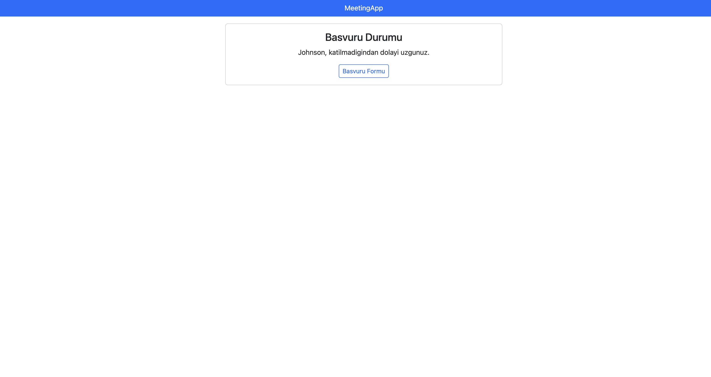

#MEETING APP 

This project is an Application Survey with basic level features (Adding Participants, Listing Participants and Non-Participants, Detail Page about them)  

##Features

    - Adding Participants
    - Listing Participants
    - Listing Non-Participants
    - Detail Page about them

##SETUP
    - .Net7 or Upper(https://dotnet.microsoft.com/en-us/download/dotnet/7.0)
    
    - libman (dotnet tool install -g Microsoft.Web.LibraryManager.Cli)

    -cdnjs,Bootstrap5.3.0(from libman)

##Screenshots
    
    
    
    
    
    